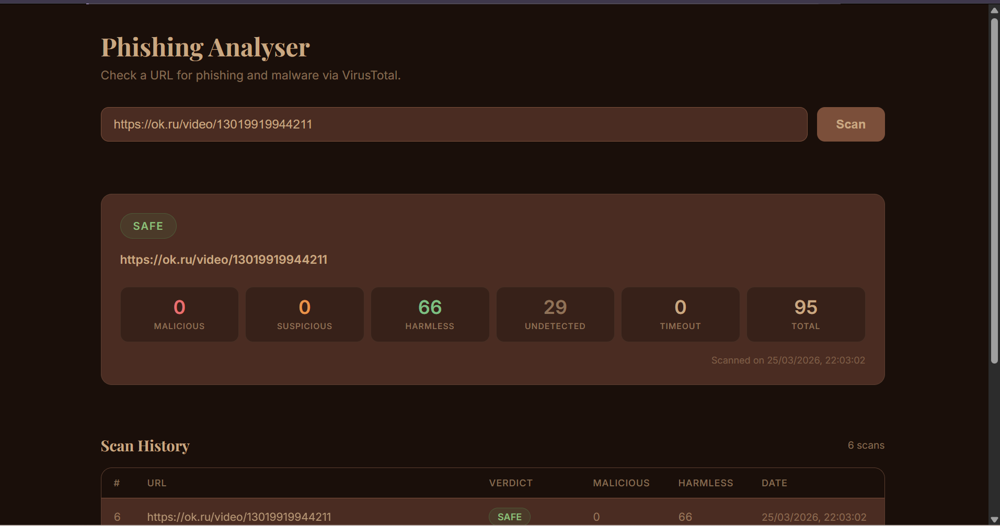
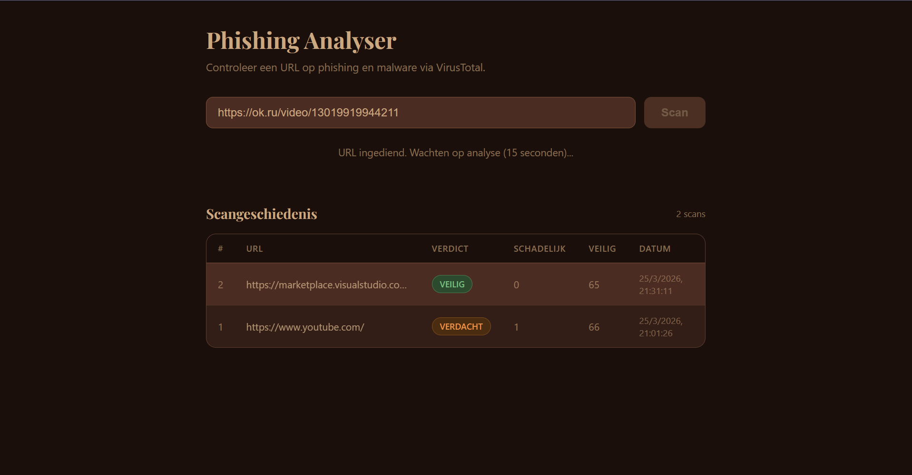

# Phishing Analyser

An automated security pipeline that analyses suspicious URLs for phishing and malware via the VirusTotal API, with a professional web interface built in Flask.

---

## Why this project?

This project was inspired by a visit to Agoria, where it became clear that cybersecurity is not just about running tools, it is about building professional, reliable systems.

At companies like Sopra Steria, the principle is always: security first, then functionality. A script with an API key hardcoded directly in the source code would be rejected immediately. That insight was the motivation to build this project according to real enterprise standards: modular code, secure configuration, error handling, and documentation.

The concrete goal was to build a Python tool that scans a URL via the VirusTotal API, converts the JSON response from more than 90 scanning engines into a readable report — all done securely and robustly, and pushed to GitHub within a fixed deadline.

---

## Screenshots

**Running a scan**


**Scan history**


---

## Project structure

```
Phishing-Threat-Intel-Pipeline/
├── main.py              # Core logic: API functions, parsing, logging
├── app.py               # Flask web server and routes
├── templates/
│   └── index.html       # Web interface
├── images/
│   ├── screenshot_scan.png
│   └── screenshot_history.png
├── scan_log.json        # Log of all scans (created automatically)
├── threats.json         # Log of threats only (created automatically)
├── .env                 # API key and thresholds (not on GitHub)
├── .gitignore
└── requirements.txt
```

---

## Installation

### Requirements

- Python 3.13 or higher
- A free VirusTotal API key from [virustotal.com](https://www.virustotal.com)

### Steps

```bash
git clone https://github.com/NolweenS/Phishing-Threat-Intel-Pipeline.git
cd Phishing-Threat-Intel-Pipeline
```

Activate the virtual environment:

```bash
# Windows
.venv\Scripts\activate

# Mac/Linux
source .venv/bin/activate
```

Install the dependencies:

```bash
pip install -r requirements.txt
```

Create a `.env` file in the project folder:

```
VT_API_KEY=your_api_key_here

# Verdict thresholds (optional — defaults shown below)
DREMPEL_GEVAARLIJK=3
DREMPEL_VERDACHT_MALICIOUS=1
DREMPEL_VERDACHT_SUSPICIOUS=3
```

---

## Running the app

**Via the terminal (no web interface):**

```bash
python main.py
```

**Via the web interface:**

```bash
python app.py
```

Then open `http://localhost:8080` in your browser.

---

## How it works

The pipeline runs in three steps:

1. **Submit** : The URL is sent to VirusTotal via a POST request and an analysis ID is returned.
2. **Wait** : The script waits 15 seconds for all scanning engines to complete their analysis.
3. **Poll** : The report is fetched via a GET request and converted into a readable result.

The verdict is determined based on configurable thresholds (set via `.env`):

| Verdict    | Condition                                               |
|------------|---------------------------------------------------------|
| Dangerous  | 3 or more engines flag the URL as malicious             |
| Suspicious | 1 engine flags as malicious, or 3 or more as suspicious |
| Safe       | No malicious or suspicious detections                   |

---

## Security and approach

| Criterion     | What was done                                  | Why                                              |
|---------------|------------------------------------------------|--------------------------------------------------|
| Security      | API key stored in `.env`                       | No risk of credential exposure                   |
| Reliability   | `try/except` blocks on all API calls           | The tool handles errors without crashing         |
| Portability   | README and GitHub                              | A colleague or teacher can pick up the project   |
| Modular       | Every step is a separate function              | Easy to extend or modify                         |
| Configurable  | Thresholds adjustable via `.env`               | No code changes needed to tune sensitivity       |

---

## Technologies used

| Tool               | Purpose                            |
|--------------------|------------------------------------|
| Python 3.13        | Programming language               |
| Flask              | Web server and routing             |
| VirusTotal API v3  | Source for threat intelligence     |
| requests           | HTTP requests                      |
| python-dotenv      | Secure configuration               |
| VS Code            | Primary IDE                        |
| GitHub             | Version control and documentation  |

---

## Log files

All scan results are saved automatically (excluded from GitHub):

- `scan_log.json` : every scan with timestamp, URL, verdict, and statistics
- `threats.json` : only suspicious and dangerous URLs, with additional context

---

## Author

Made by Nolween Sine
2nd year student — Applied Computer Science | Erasmus Brussels University of Applied Sciences and Arts
Academic year 2025–2026
